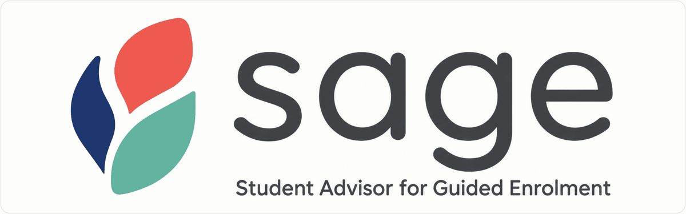

<!-- PROJECT HEADER -->

  

  

    A registration-planning prototype that connects course choices, university rules and grounded advice.
     
    <a href="https://bumemxenge.github.io/SAGE/prototypes/SAGE%20Onboarding.html"><strong>View onboarding prototype</strong></a>
    &middot;
    <a href="https://bumemxenge.github.io/SAGE/prototypes/SAGE%20Registration%20Planner.html"><strong>View planning prototype</strong></a>
  

<!-- TABLE OF CONTENTS -->

  
Table of Contents

  <ol>
    <li><a href="#about-the-project">About the Project</a></li>
    <li><a href="#planned-capabilities">Planned Capabilities</a></li>
    <li><a href="#technical-direction">Technical Direction</a></li>
    <li><a href="#project-status">Project Status</a></li>
    <li><a href="#contributor">Contributor</a></li>
  </ol>

<!-- ABOUT THE PROJECT -->
## About the Project

SAGE stands for **Student Advisor for Guided Enrolment**. It is being designed to help an enrolled student construct, understand and refine a valid course selection for the coming academic year.

The initial scope is the three degrees administered by UCT's Department of Electrical Engineering, including mainstream and ASPECT routes. A student's academic record, curriculum rules, course offerings, timetable and preferences all affect which plans are possible. SAGE is intended to show valid options and explain when a proposed course cannot fit.

The design has one firm boundary: a deterministic engine decides validity. The conversational advisor uses engine results and handbook passages to explain decisions, and refers questions without evidence to a human advisor. Chat can propose a change to the student's plan; the student confirms it. A shared plan service is intended to keep the visual plan and chat in sync.

(<a href="#readme-top">back to top</a>)

### Planned Capabilities

- **Academic record:** Import and confirm the student's record before planning.
- **Rule and timetable checks:** Check entry requirements, credit rules, course offerings and clashes.
- **Plan exploration:** Generate valid annual plans and filter them by student preferences, with any search limit made clear.
- **Explanations:** Give structured reasons for exclusions or conditional choices, with source citations where appropriate.
- **Grounded advisor:** Answer in the context of the current plan and present changes for student confirmation.
- **Shared plan:** Keep timetable edits and advisor context on one saved, versioned plan.
- **Annual updates:** Review handbook-year rule changes before an administrator activates them.
- **Human hand-off:** Save, recheck and export a plan for review with a faculty advisor.

(<a href="#readme-top">back to top</a>)

<!-- TECHNICAL DIRECTION -->
## Technical Direction

These are the selected technologies and development tools for the planned implementation. The current HTML prototypes are not yet connected to this stack.

**Interface**

[![React][React.js]][React-url] [![TypeScript][TypeScript]][TypeScript-url]

**Backend**

[![Python][Python]][Python-url]

**Knowledge store**

[![Supabase][Supabase]][Supabase-url] [![PostgreSQL][PostgreSQL]][PostgreSQL-url] [![pgvector][pgvector]][pgvector-url]

**Development and deployment**

[![VS Code][VSCode]][VSCode-url] [![GitHub Actions][GitHubActions]][GitHubActions-url] [![Docker][Docker]][Docker-url]

Python will support ingestion, deterministic rule evaluation, the plan service and advisor tools. Supabase Postgres is the selected store for versioned rules, plans and handbook passages. The API and built React interface are intended to run in one container on a managed host.

The PDF library, plan solver, embedding and search configuration, language model, and synchronisation protocol will be selected through design experiments.

(<a href="#readme-top">back to top</a>)

<!-- STATUS -->
## Project Status

The onboarding and registration planner have interactive HTML prototypes with mock data. The implementation roadmap below covers the application only.

| Stage | Implementation work | Status |
| --- | --- | --- |
| 1. Interface prototypes | Explore the onboarding and planning flows with mock data. | ✅ Complete |
| 2. Data foundation | Ingest handbook and timetable sources, verify extracted rules and build the versioned knowledge store. | 📍 Current starting point |
| 3. Planning engine | Implement eligibility checks, valid plan search and structured explanations. | Planned |
| 4. Advisor | Add handbook retrieval, engine tools, grounded answers and student-confirmed proposals. | Planned |
| 5. Shared state and interface | Connect the React interface to the plan service and synchronise timetable and chat changes. | Planned |
| 6. Deployment and system checks | Deploy the integrated application and run end-to-end, load, access and usability checks. | Planned |

(<a href="#readme-top">back to top</a>)

<!-- CONTRIBUTOR -->
## Contributor

- **Bume Mxenge:** [GitHub](https://github.com/BumeMxenge) &middot; [LinkedIn](https://www.linkedin.com/in/bume-mxenge/)

(<a href="#readme-top">back to top</a>)

<!-- BADGE LINKS -->
[React.js]: https://img.shields.io/badge/React-20232A?style=for-the-badge&logo=react&logoColor=61DAFB
[React-url]: https://react.dev/
[TypeScript]: https://img.shields.io/badge/TypeScript-007ACC?style=for-the-badge&logo=typescript&logoColor=white
[TypeScript-url]: https://www.typescriptlang.org/
[Python]: https://img.shields.io/badge/Python-3776AB?style=for-the-badge&logo=python&logoColor=white
[Python-url]: https://www.python.org/
[Supabase]: https://img.shields.io/badge/Supabase-3FCF8E?style=for-the-badge&logo=supabase&logoColor=white
[Supabase-url]: https://supabase.com/
[PostgreSQL]: https://img.shields.io/badge/PostgreSQL-4169E1?style=for-the-badge&logo=postgresql&logoColor=white
[PostgreSQL-url]: https://www.postgresql.org/
[pgvector]: https://img.shields.io/badge/pgvector-336791?style=for-the-badge&logo=postgresql&logoColor=white
[pgvector-url]: https://github.com/pgvector/pgvector
[VSCode]: https://img.shields.io/badge/VS_Code-007ACC?style=for-the-badge&logo=visualstudiocode&logoColor=white
[VSCode-url]: https://code.visualstudio.com/
[GitHubActions]: https://img.shields.io/badge/GitHub_Actions-2088FF?style=for-the-badge&logo=githubactions&logoColor=white
[GitHubActions-url]: https://github.com/features/actions
[Docker]: https://img.shields.io/badge/Docker-2496ED?style=for-the-badge&logo=docker&logoColor=white
[Docker-url]: https://www.docker.com/